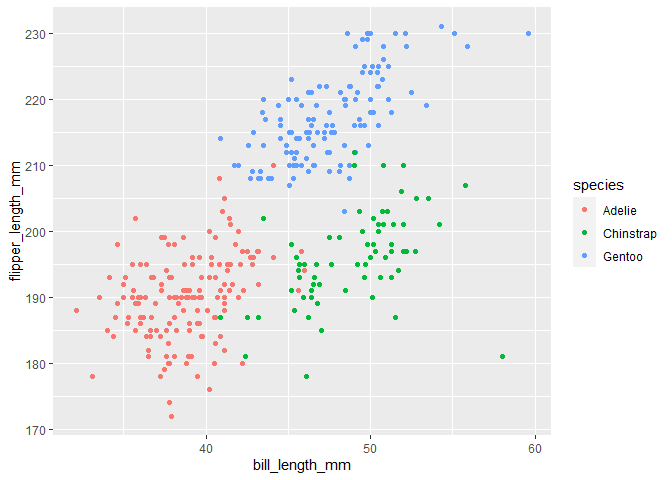

Homework 1
================
Ying Jin
2020/9/15

This is the first homework of P8105.

## Problem 1

First I create a data frame:

``` r
prob1_df <- tibble(
  norm_samp = rnorm(10),
  samp_gt_0 = norm_samp > 0,
  char_vec = c('a','b','c','d','e','f','g','h','i','g'),
  factor_vec = factor(c('l','l','s','m','m','s','l','s','m','l'))
)
```

Then I take the `mean` of each variable in the data frame:

``` r
mean(pull(prob1_df,norm_samp))
```

    ## [1] -0.1316605

``` r
mean(pull(prob1_df,samp_gt_0))
```

    ## [1] 0.3

``` r
mean(pull(prob1_df,char_vec))
```

    ## Warning in mean.default(pull(prob1_df, char_vec)): argument is not numeric or
    ## logical: returning NA

    ## [1] NA

``` r
mean(pull(prob1_df,factor_vec))
```

    ## Warning in mean.default(pull(prob1_df, factor_vec)): argument is not numeric or
    ## logical: returning NA

    ## [1] NA

According to the outcome above, `mean` function works on **numeric** and
**logical** variables, but doesn’t work on **character** and **factor**
variables.

Next I apply `as.numeric` function to the **logical**,**character** and
**factor** variables:

``` r
as.numeric(pull(prob1_df,samp_gt_0))
as.numeric(pull(prob1_df,char_vec))
as.numeric(pull(prob1_df,factor_vec))
```

According to the results which are not shown here, **logical** and
**factor** variables can be converted into numeric, while **character**
variable can not. I think that’s because **logical** and **factor**
values are stored as integers rather than characters in computer. In
this way, the reason why `mean` function works on **logical** variable
but not on **character** variable is clear. However, it can’t help to
explain why I can’t get mean of the factor variable by applying `mean`
function.

At last, I do some conversation and multiplication on these variables:

``` r
as.numeric(pull(prob1_df,samp_gt_0))*pull(prob1_df,norm_samp)
```

    ##  [1] 0.6475351 0.0000000 0.0000000 0.0000000 0.0000000 3.4012817 0.0000000
    ##  [8] 0.0000000 0.0000000 0.2464466

``` r
as.factor(pull(prob1_df,samp_gt_0))*pull(prob1_df,norm_samp)
```

    ## Warning in Ops.factor(as.factor(pull(prob1_df, samp_gt_0)), pull(prob1_df, : '*'
    ## not meaningful for factors

    ##  [1] NA NA NA NA NA NA NA NA NA NA

``` r
as.numeric(as.factor(pull(prob1_df,samp_gt_0)))*pull(prob1_df,norm_samp)
```

    ##  [1]  1.29507023 -0.43917710 -0.03727855 -0.88309785 -2.20050309  6.80256335
    ##  [7] -0.04139117 -0.82464711 -1.18577302  0.49289319

## Problem 2

First I load the `penguins` dataset:

``` r
data("penguins", package = "palmerpenguins")
```

Then I make a description of `penguins` dataset:

  - Brief Description of `penguins`
      - The variables include species, island, bill\_length\_mm,
        bill\_depth\_mm, flipper\_length\_mm, body\_mass\_g, sex, year.
          - species include Adelie, Chinstrap, Gentoo.
          - island include Biscoe, Dream, Torgersen.
          - bill\_length\_mm ranges from 32.1 mm to 59.6 mm, with the
            median of 44.45 mm.
          - bill\_depth\_mm ranges from 13.1 mm to 21.5 mm, with the
            median of 17.3 mm.
          - flipper\_length\_mm ranges from 172 mm to 231 mm, with the
            median of 197 mm.
          - body\_mass\_g ranges from 2700 g to 6300 g, with the median
            of 4050 g.
          - sex is female, male.
          - year includes 2007, 2008, 2009.
      - It has 344 rows and 8 columns.
      - The mean flipper length is 200.92 mm.

Next I make a scatter plot of `flipper_length_mm` vs `bill_length_mm`,
with `species` as color points:

``` r
ggplot(penguins,aes(x = bill_length_mm,y = flipper_length_mm,color = species)) + geom_point()
```

    ## Warning: Removed 2 rows containing missing values (geom_point).

<!-- -->

Last, I export the scatter plot to my project directory:

``` r
ggsave("flipper_length_vs_bill_length.png",path = here::here())
```

    ## Saving 7 x 5 in image

    ## Warning: Removed 2 rows containing missing values (geom_point).
